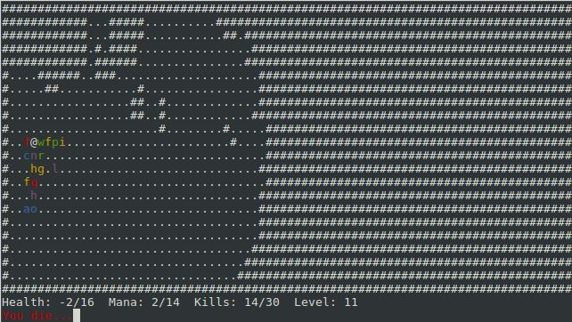
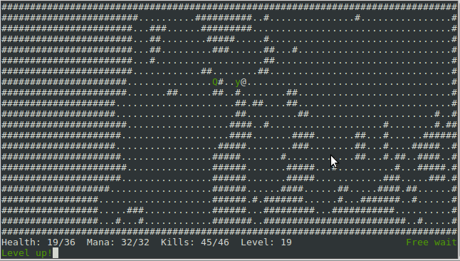

<div align="center">

# Endless Descent
## Into the Dark and Dangerous Dungeons
### of the
#### Most Reprehensible Alphabetical Overlord:
##### Quest for Gore and Vengenace
</div>
<br/>
<br/>
<br/>
Simple, silly coffebreak roguelike for the Seven Day Roguelike Challenge 2019.


### How to play

Unzip and open the game directory, then open terminal there and type:

```
$ ./7drl
```

On Linux, you can open terminal in a folder by right clicking and selecting to

open terminal here, the same can be done on Windows by holding Shift and right

clicking.

### Building

Use the following commands:

```
$ cd src
$ make
$ ./main
```

You will need the ncurses library to compile.

### Controls

```
Arrow keys to move, or (q)uit.

Use mana to
  (.)wait [1 mana]
  (t)eleport [3 mana]
  (w)hirlwind attack [3 mana]
  (f)reeze time [5 mana]
  (h)eal [10 mana]

Gain mana by killing enemies.

Press (?) for more help.
```

Have fun!

### Screenshots





